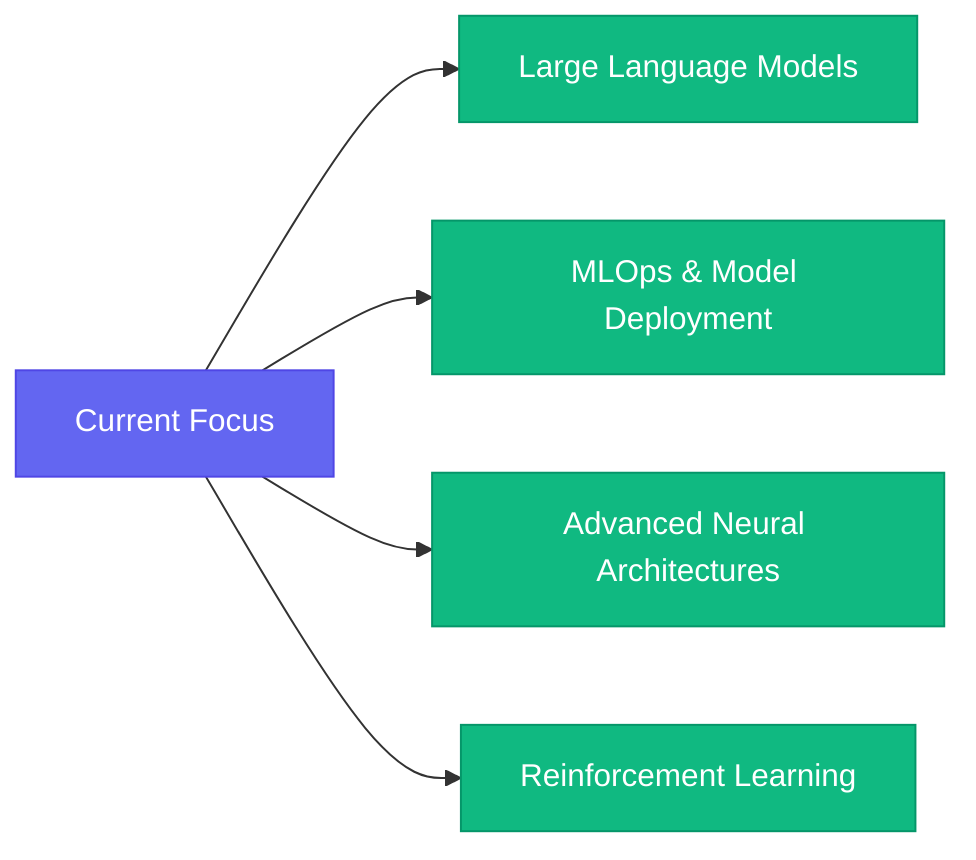

<div align="center">
  
</div>

<div align="center">
  
[](https://git.io/typing-svg)

<p align="center">
  
  
  
</p>

</div>

---

## 👨‍💻 About Me

```python
class ShanakaDev:
    def __init__(self):
        self.name = "Shanaka Kalubowilage"
        self.role = "Data Science Undergraduate"
        self.institution = "SLIIT - Sri Lanka Institute of Information Technology"
        self.current_level = "3rd Year | 1st Semester"
        self.location = "Sri Lanka 🇱🇰"
        self.email = "sskalubowilage@gmail.com"
        
        self.expertise = {
            "data_science": ["Machine Learning", "Deep Learning", "Data Analytics"],
            "ai_domains": ["Computer Vision", "Natural Language Processing", "Predictive Modeling"],
            "specialization": ["Statistical Analysis", "Model Optimization", "Feature Engineering"]
        }
        
        self.current_focus = [
            "🧠 Advanced Machine Learning Algorithms",
            "🤖 Deep Learning Architectures (CNNs, RNNs, Transformers)",
            "📊 Big Data Technologies & Distributed Computing",
            "🔬 Research in AI & Explainable AI"
        ]
    
    def get_daily_routine(self):
        return {
            "morning": "☕ Coffee + Research Papers",
            "afternoon": "💻 Code + Build ML Models",
            "evening": "📚 Learn New Techniques",
            "night": "🚀 Work on Personal Projects"
        }
    
    def say_hello(self):
        return "Thanks for visiting! Let's connect and innovate together! 🚀"

# Initialize
shanaka = ShanakaDev()
print(shanaka.say_hello())
```

<div align="center">

### 🎯 Mission Statement

*"Bridging the gap between raw data and actionable intelligence through innovative AI solutions"*

</div>

---

## 🛠️ Technology Stack

<div align="center">

### 💻 Programming Languages


### 🤖 Machine Learning & Deep Learning


### 📊 Data Science & Analytics


### 🗄️ Databases & Big Data


### 📈 Business Intelligence & Visualization


### ☁️ Cloud & DevOps


### 🔧 Tools & IDEs


</div>

---

## 📊 GitHub Statistics

<div align="center">
  
  
</div>

<div align="center">
  
</div>

<div align="center">
  
</div>

---

## 🏆 GitHub Achievements

<div align="center">
  
</div>

---

## 🔥 Featured Projects

<div align="center">

<!-- Replace these with your actual repository names -->
[](https://github.com/SasinduShanaka/life_guard_assurance)
[](https://github.com/SasinduShanaka/ServSync)

</div>

---

## 💼 Professional Experience & Skills

<div align="center">

| Domain | Skills |
|--------|--------|
| 🎯 **Machine Learning** | Supervised & Unsupervised Learning, Ensemble Methods, Model Tuning |
| 🧠 **Deep Learning** | Neural Networks, CNNs, RNNs, Transfer Learning, GANs |
| 👁️ **Computer Vision** | Object Detection, Image Classification, Segmentation |
| 💬 **NLP** | Text Classification, Sentiment Analysis, Language Models |
| 📊 **Data Analysis** | Statistical Analysis, Hypothesis Testing, A/B Testing |
| 📈 **Visualization** | Interactive Dashboards, Storytelling with Data |

</div>

---

## 📈 Contribution Insights

<div align="center">
  
</div>

<div align="center">
  
  
</div>

---

## 🌐 Connect With Me

<div align="center">

[](https://linkedin.com/in/shanaka-kalubowilage)
[](https://github.com/SasinduShanaka)
[](mailto:sskalubowilage@gmail.com)
[](https://kaggle.com/yourusername)
[](https://medium.com/@yourusername)

</div>

---

## 📚 Currently Learning

<div align="center">



</div>

---

<div align="center">
  
### 💭 Data Science Quote of the Day


<!--
### 🐍 Contribution Snake

-->
</div>

---

## 📊 Weekly Development Breakdown

<!--START_SECTION:waka-->
<!--END_SECTION:waka-->

---

<div align="center">

### 🎓 Education

**Sri Lanka Institute of Information Technology (SLIIT)**  
*Bachelor of Science in Data Science*  
📅 3rd Year, 1st Semester | 🇱🇰 Sri Lanka

</div>

---

<div align="center">

### ⚡ Fun Facts

🎯 I believe in the power of data to change the world  
🚀 Always exploring the latest in AI and ML research  
💡 Love turning complex problems into elegant solutions  
🌱 Continuous learner, forever curious  
☕ Powered by coffee and algorithms  

</div>

---

<div align="center">
  
</div>

<div align="center">
  
**"In the world of data science, the only constant is learning."** 📊🚀

[](https://github.com/SasinduShanaka)

⭐️ From [SasinduShanaka](https://github.com/SasinduShanaka) | Last Updated: October 2025

</div>
